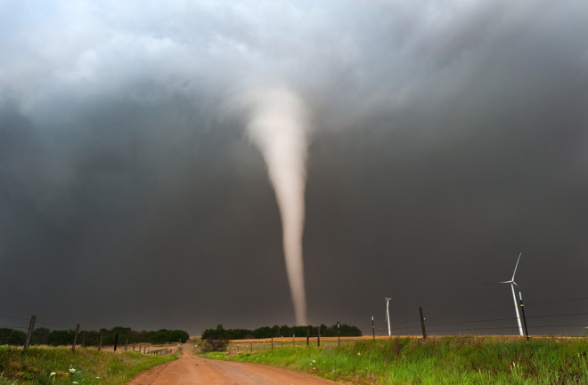

```{r global_options, echo=FALSE}
knitr::opts_chunk$set(fig.height=3, fig.width=4, warning=FALSE, tidy=TRUE, tidy.opts=list(width.cutoff=60))
```

Required Packages:
```{r}
install.packages('gridExtra')
library(gridExtra)
install.packages('ggplot2')
library(ggplot2)
install.packages('knitr')
library(knitr)
install.packages('kableExtra')
library(kableExtra)
```

## 1. Introduction

This report analyzes a data set of all the tornadoes that occurred within the United States in 2022. The data was collected by the National Oceanic and Atmospheric Administration's (NOAA) National Weather Service Storm Prediction Center, and was accessed via their [Severe Weather Maps, Graphics, and Data Page](https://www.spc.noaa.gov/wcm/#data).

Within this data set, I'm going to be focusing on the injuries caused by tornadoes. I'll analyze how the Magnitude, Length, and Width of these tornadoes contribute to the likelihood of injuries.



[Tornadoes on the Move](https://www.discovermagazine.com/environment/tornadoes-on-the-move)

## Analysis

```{r echo=FALSE}
tornados <- read.csv('Project1_Tornados.csv')
```

### 2. Outcome Variable: Injuries by US Tornadoes

```{r echo=FALSE}
t_ggplot <- ggplot(tornados)

#Injuries Bar Graph
t_ggplot + geom_bar(aes(x=injuries, fill=injuries)) + labs(title='Injuries by US Tornados in 2022', x='Were there injuries?', y='Frequency', fill='Injuries?') + theme_classic()
```

```{r echo = FALSE}

#Nicely formatted table of Injury proportion
injury_table <- prop.table(table(tornados$injuries))
injury_df <- as.data.frame(injury_table)
colnames(injury_df)[1] <- "Injuries?"
colnames(injury_df)[2] <- "Proportion"

kable(injury_df, caption = "Proportion of Injuries from Tornados", digits = 4)

```

As we can see from both the graph and the table, the percentage of tornadoes that caused injuries in 2022 was approximately [ **11%** ]{style="color: blue; font-family: 'Courier New'; font-size: 18px;"}, showing that the majority of tornadoes in the US don't produce injuries.

### 3a. Bivariate Predictor: Magnitude relative to Injuries

The magnitude of tornadoes is measured by wind speed on the Enhanced Fujita (EF) scale, which measures between 0 and 5 with 5 being the highest magnitude of tornadoes. [Explanation of EF Scale](https://www.weather.gov/oun/efscale#:~:text=The%20Enhanced%20Fujita%20Scale%20or,wind%20speeds%20and%20related%20damage.)

```{r echo=FALSE}

#Subset data by Yes and No Injuries

injuriesYes <- tornados[tornados$injuries == 'yes',]
injuriesNo <- tornados[tornados$injuries == 'no',]

#Histogram for No
histNo <- ggplot(injuriesNo, aes(x = magnitude)) + geom_histogram(aes(y = ..count../sum(..count..)), binwidth = 0.5, color = "black", fill = "red")+ labs(x = 'Magnitude', y = 'Proportion', title = 'Injuries: No') + scale_y_continuous(labels = scales::percent_format()) + theme_classic() 

#Histogram for Yes
histYes <- ggplot(injuriesYes, aes(x = magnitude)) + geom_histogram(aes(y = ..count../sum(..count..)), binwidth = 0.5, color = "black", fill = "blue", alpha = 0.5) + labs(x = 'Magnitude', y = 'Proportion', title = 'Injuries: Yes') + scale_y_continuous(labels = scales::percent_format()) + theme_classic()

# Display the plots side by side
grid.arrange(histNo, histYes, ncol = 2)

mean_magnitude <- aggregate(tornados$magnitude ~ tornados$injuries, data = tornados, mean)


mean_yes <- mean_magnitude[mean_magnitude$`tornados$injuries` == "yes", 2]

mean_no <- mean_magnitude[mean_magnitude$`tornados$injuries` == "no", 2]

```

Based on the graph above, we can see that more than [ **80%** ]{style="color: red; font-family: 'Courier New'; font-size: 18px;"} of the tornadoes that caused no injuries were a magnitude 1, with the mean magnitude being [ **`r round(mean_no, 3)`** ]{style="color: red; font-family: 'Courier New'; font-size: 18px;"}. Consequentially, the average magnitude of tornadoes that produced injuries was [ **`r round(mean_yes, 3)`** ]{style="color: blue; font-family: 'Courier New'; font-size: 18px;"}. The majority of tornadoes that did cause injuries fell were magnitude 2, with multiple being magnitude 3 or greater.

### 3b. Bivariate Predictor: Length of Tornado Relative to Injuries

```{r echo = FALSE}
#Length vs Injuries plot
t_ggplot + geom_boxplot(aes(x=injuries, y=length_miles, fill=injuries)) + labs(x='Were there injuries?', y='Length (Miles)', title='Injuries relative to Length of Tornado', fill='Injuries?') + theme_classic() + ylim(0,40)

mean_length <- aggregate(tornados$length_miles ~ tornados$injuries, data = tornados, mean)

mean_yes1 <- mean_length[mean_length$`tornados$injuries` == "yes", 2]

mean_no1 <- mean_length[mean_length$`tornados$injuries` == "no", 2]

```

Based on the graph above, we can see that the Interquartile Range of tornadoes that caused injuries was higher than those that didn't with an average length of [**`r round(mean_yes1, 3)`**]{style="color: blue; font-family: 'Courier New'; font-size: 18px;"} miles. . Tornadoes that didn't cause injuries had an average length of [**`r round(mean_no1, 3)`**]{style="color: red; font-family: 'Courier New'; font-size: 18px;"} miles.

### 3c. Bivariate Predictor: Width of Tornado Relative to Injuries

```{r echo = FALSE}
#Width vs Injuries plot
t_ggplot + geom_boxplot(aes(x=injuries, y=width_yards, fill=injuries)) + labs(x='Were there injuries?', y='Width(Yards)', title='Injuries relative to Width of Tornado', fill='Injuries?') + theme_classic() 

mean_width <- aggregate(tornados$width_yards ~ tornados$injuries, data = tornados, mean)

mean_yes2 <- mean_width[mean_width$`tornados$injuries` == "yes", 2]

mean_no2 <- mean_width[mean_width$`tornados$injuries` == "no", 2]
```

Based on the graph, we see that the Interquartile range of the tornadoes that caused injuries was higher than those that didn't with an average width of [**`r round(mean_yes2, 2)`**]{style="color: blue; font-family: 'Courier New'; font-size: 18px;"} yards. . Tornadoes that didn't cause injuries had an average width of [**`r round(mean_no2, 2)`**]{style="color: red; font-family: 'Courier New'; font-size: 18px;"} yards.

### 3d. Multivariate Plot: Tornado Injuries Relative to Length and Width

```{r echo = FALSE}

#Multivariate Plot of Width and Length to Injuries
ggplot(tornados, aes(x = length_miles, y = width_yards, color = injuries)) + geom_point(alpha = 0.6, size = 2) +  
  labs(title = "Relationship between Injuries and Tornado Characteristics", x = "Length (miles)", y = "Width (yards)", color = "Injuries") + theme_minimal() + 
  scale_color_manual(values = c("yes" = "blue", "no" = "red")) +  theme(legend.position = "right") + xlim(0,20)

```

Based on the above graph, we see that the concentration of tornadoes with no injuries falls into the bottom left corner, which indicates they were neither wide nor long. We see that tornadoes that had injuries are more spread around the graph, leaning towards the top right of the graph. This indicates that those that did have injuries tended to be both wider and longer.

## 4. Choice Report Elements

1.  Included 3 working hyperlinks providing information for the data source, info on the EF Scale, as well as in the image citation.

2.  Included a floating Table of Contents that includes the Introduction, Analysis and it's sub-sections, My Project Choice Elements, and the Conclusion.

3.  I created a subset of the data by categorizing the "Injuries" variable into "yes" and "no" groups to analyze the proportion of each category at the various magnitudes.

4.  Created a Multivariate plot relating both Length and Width to Injuries

5.  Included inline statistics describing the differences between injury and non-injury groups.

6.  Changed font and color of different inline report statistics. Red for statistics when there were no injuries. Blue for statistics when there were injuries.

## 5. Conclusion

This analysis of the 2022 tornado data from NOAA highlights the significant relationship between tornado magnitude, length, width, and the likelihood of injuries. While only 11% of tornadoes in 2022 caused injuries, those that did were generally of higher magnitude (average EF2.108) compared to non-injury tornadoes (average EF1.188). Tornadoes resulting in injuries were also notably longer (12.129 miles vs. 5.598 miles) and wider (498.86 yards vs. 254.44 yards), suggesting that larger and stronger tornadoes are more likely to harm people. Tornadoes that caused no injuries clustered in the lower magnitude, shorter length, and narrower width categories, while injury-causing tornadoes were more dispersed, tending towards greater size and intensity. Future research could explore factors such as population density, the effectiveness of warning systems, timing of tornadoes, and the role of infrastructure in mitigating injuries.

**References**

National Oceanic and Atmospheric Administration (NOAA). [National Weather Service Storm Prediction Center: Severe Weather Maps, Graphics, and Data Page.](https://www.spc.noaa.gov/wcm/#data)

National Weather Service [Enhanced Fujita (EF) Scale](https://www.weather.gov/oun/efscale)
